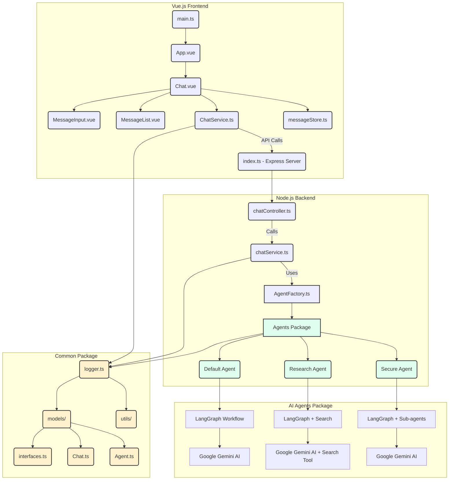

# LLMOps デモ TypeScript

[!WARNING]
この document は，[README](./README.md) の日本語訳です。
更新が遅れることがあります。

Vue.js フロントエンド、Node.js バックエンド、そして Google Gemini AI を搭載した LangGraph ベースの AI エージェントを使用した、LLMOps の実践を示すモジュラーモノレポです。

## 特徴

- 🤖 **AI 搭載チャット**: Google Gemini AI を使用した高度な会話
- 💬 **リアルタイムストリーミング**: Server-Sent Events (SSE) によるライブレスポンスストリーミング
- 🎨 **モダン UI**: クリーンでレスポンシブな Vue.js インターフェース
- 🔧 **モジュラーアーキテクチャ**: バックエンドとフロントエンドのパッケージを分離し、LangGraph にインスパイアされたロジックフローを採用
- 📱 **モバイルフレンドリー**: 全デバイスで動作するレスポンシブデザイン

## 📚 LLM アプリ開発コース

本リポジトリを使用して、LLM アプリケーションの構築と LLMOps の実践を学ぶ包括的なコースを提供しています。環境構築、エージェント開発、セキュリティ、評価について学ぶことができます。

👉 **[コースを開始する](./docs/projects/ja/README.md)**

## 技術スタック

### フロントエンド (`packages/frontend`)

- **Vue.js 3** (Composition API)
- **Vite** (高速な開発とビルド)
- **TypeScript** (型安全性)
- **Pinia** (状態管理)
- **Playwright** (E2E テスト)

### バックエンド (`packages/backend`)

- **Node.js** (Express)
- **TypeScript** (型安全性)
- **tsoa** (OpenAPI 仕様の生成とルーティング)
- **LangSmith** (オブザーバビリティとトレーシング)

### エージェント (`packages/agents`)

- **Google Gemini AI** (`@google/genai`) (チャットレスポンス)
- **LangChain/LangGraph** (エージェントオーケストレーション)
- **Commander.js** (CLI インターフェース)
- **TypeScript** (型安全性)
- **LangSmith** (オブザーバビリティ)

### 共通 (`packages/common`)

- **TypeScript** (ユーティリティと共有型)
- **Winston** (ロギング)
- **共有インターフェースとモデル** (パッケージ間)

## システムアーキテクチャ

本アプリケーションは、フロントエンド、バックエンド、エージェント、共通の4つの主要パッケージを持つモジュラーモノリスアーキテクチャを採用しています。Vue.js フロントエンドは RESTful API を介して Node.js バックエンドと通信します。バックエンドは、LangGraph ワークフローを通じて Google Gemini AI モデルを活用する、分離されたエージェントパッケージからの AI エージェントをオーケストレーションします。



### パッケージ詳細

#### フロントエンドアーキテクチャ

フロントエンドは Vite で構築された Vue.js 3 アプリケーションで、AI エージェントと対話するためのモダンなチャットインターフェースを提供します。

- `main.ts`: Vue アプリケーションのエントリーポイント。アプリを初期化しマウントします。
- `App.vue`: メインのチャットインターフェースをレンダリングするルートコンポーネント。
- `Chat.vue`: ユーザー入力、メッセージ表示、エージェント選択を管理するメインチャットインターフェースコンポーネント。
- `MessageInput.vue`: 送信機能を持つユーザーメッセージ入力用コンポーネント。
- `MessageList.vue`: チャットメッセージをスクロール可能なリストで表示するコンポーネント。
- `ChatService.ts`: バックエンド API エンドポイントとの HTTP 通信を処理するサービスクラス。
- `messageStore.ts`: チャットメッセージ、ローディング状態、エージェント選択のグローバル状態を管理する Pinia ストア。

#### バックエンドアーキテクチャ

バックエンドは Node.js Express アプリケーションで、型安全な API ルーティングと OpenAPI 仕様の生成に tsoa を使用しています。フロントエンドと AI エージェント間の API ゲートウェイとして機能します。

- `index.ts`: ミドルウェア設定、ヘルスチェック、ルート登録を行うメイン Express サーバーセットアップ。
- `chatController.ts`: チャット対話とストリーミングレスポンスのための REST API エンドポイントを定義する tsoa コントローラー。
- `chatService.ts`: チャットメッセージを処理し、AI エージェントと調整するビジネスロジックサービス。
- `tsoa.config.json`: tsoa コード生成と API 仕様のための設定。
- `src/generated/`: tsoa デコレーターから自動生成されたルートと OpenAPI 仕様。

#### エージェントアーキテクチャ

エージェントパッケージには、様々な会話タスクのために Google Gemini AI モデルを活用する LangGraph ベースの AI エージェントが含まれています。

- `agentFactory.ts`: 異なる AI エージェントインスタンスを作成・管理するためのファクトリークラス。
- `baseAgent.ts`: 全エージェントに共通の機能を提供する抽象基本クラス。
- `default_agent/`: 基本的な会話機能を持つ汎用 AI アシスタント。
- `research_agent/`: 情報収集と統合に特化した研究エージェント。検索クエリを計画し、Web 検索（Google Search Tool 経由）を実行し、結果を統合してユーザーの質問に包括的に答えます。
- `secure_agent/`: プロンプトインジェクションを防ぎ、機密情報を扱うためのセキュリティ強化エージェント。入力サニタイズ、リクエスト応答、出力サニタイズを内部のサブエージェントを通じてオーケストレーションします。
- `cli.ts`: エージェントと直接対話するためのコマンドラインインターフェース。
- `utils/`: GenAI クライアント設定やエージェントユーティリティを含む共有ユーティリティ。

#### 共通アーキテクチャ

共通パッケージは、全パッケージで使用される共有 TypeScript 型、ユーティリティ、ロギング機能を提供します。

- `logger.ts`: アプリケーション全体で使用される Winston ベースのロギング設定。
- `models/`: Agent、Chat、その他のドメインモデルのための共有 TypeScript インターフェース。
- `utils/`: パス解決や共通操作のためのユーティリティ関数。

## 始め方

以下の手順に従って、ローカルマシンでアプリケーションを起動してください。

### 前提条件

- [Node.js](https://nodejs.org/en/) (v20 以上)
- [pnpm](https://pnpm.io/)
- [Trunk IO](https://trunk.io/) (Homebrew経由: `brew install trunk-io`)

### インストール

1. **リポジトリをクローン:**

   ```bash
   git clone https://github.com/your-repo/llmops-demo-ts.git
   cd llmops-demo-ts
   ```

2. **依存関係をインストール:**

   ```bash
   pnpm install
   ```

3. **環境変数を設定:**
   環境変数テンプレートファイルをコピーし、設定に合わせて更新してください。

   ```bash
   cp env_template.txt .env
   ```

   `.env` ファイルを編集し、Google API Key、Vertex AI プロジェクト詳細、および/または LangSmith API key を追加します。

### アプリケーションの実行

フロントエンドとバックエンドを同時に実行するには、ルートディレクトリで `pnpm dev` を使用できます。または、個別に実行することも可能です。


1. **バックエンドを起動:**

   ```bash
   cd packages/backend
   pnpm dev
   ```

   バックエンドサーバーは `http://localhost:3000` で起動します。

2. **フロントエンドを起動:**

   ```bash
   cd packages/frontend
   pnpm dev
   ```

   フロントエンド開発サーバーは `http://localhost:4200` で起動します。

   ブラウザを開き、`http://localhost:4200` にアクセスしてチャットアプリケーションを利用してください。

## テストの実行

### バックエンドテスト

バックエンドのユニットテストを実行するには:

```bash
cd packages/backend
pnpm test
```

### フロントエンドテスト

Playwright を使用してフロントエンドの E2E テストを実行するには:

```bash
cd packages/frontend
pnpm test:e2e
```

## エージェント

本アプリケーションは、特定の目的のために設計された3つの異なる AI エージェントを備えています。

- **Default Agent (デフォルトエージェント)**: 会話履歴を保持し、オプションで関数呼び出しを通じてツールを実行できる汎用 AI アシスタント。
  - [README](/packages/agents/src/agents/default_agent/README.md)

- **Research Agent (リサーチエージェント)**: 情報収集と統合に特化した AI アシスタント。検索クエリを計画し、Web 検索（Google Search Tool 経由）を実行し、結果を統合してユーザーの質問に包括的に答えます。
  - [README](/packages/agents/src/agents/research_agent/README.md)

- **Secure Agent (セキュアエージェント)**: プロンプトインジェクションを防ぎ、機密情報を扱うためのセキュリティ強化機能を備えた AI アシスタント。入力サニタイズ、リクエスト応答、出力サニタイズを内部のサブエージェントを通じてオーケストレーションします。
  - [README](/packages/agents/src/agents/secure_agent/README.md)

## CLI コマンド

エージェントパッケージには、AI エージェントと直接対話するための Commander.js で構築された CLI ツールが含まれています。CLI は、個々のエージェントの実行と評価の管理をサポートしています。

### 基本的なエージェントコマンド

コマンドラインから直接 AI エージェントを実行します:

- **Default Agent:**

  ```bash
  pnpm --filter @llmops-demo-ts/agents cli default-agent run -t "Your message here" --model gemini-2.5-flash
  ```

- **Research Agent:**

  ```bash
  pnpm --filter @llmops-demo-ts/agents cli research-agent run -t "Your research query here" --model gemini-2.5-flash
  ```

- **Secure Agent:**

  ```bash
  pnpm --filter @llmops-demo-ts/agents cli secure-agent run -t "Your secure message here" --model gemini-2.5-flash
  ```

### 評価コマンド

Secure Agent とそのサブエージェントのための包括的な評価を実行します:

- **Secure Agent の全評価を実行:**

  ```bash
  pnpm --filter @llmops-demo-ts/agents cli secure-agent eval
  ```

- **Input Sanitizer (入力サニタイザー) の評価:**

  ```bash
  # LLM-as-a-judge 評価を実行
  pnpm --filter @llmops-demo-ts/agents cli secure-agent input-sanitizer langsmith eval-llm-as-judge

  # 評価用データセットを作成
  pnpm --filter @llmops-demo-ts/agents cli secure-agent input-sanitizer langsmith create-dataset-llm-as-judge
  ```

- **Answer Agent (回答エージェント) の評価:**

  ```bash
  # LLM-as-a-judge 評価を実行
  pnpm --filter @llmops-demo-ts/agents cli secure-agent answer-agent langsmith eval-llm-as-judge

  # マルチターン評価を実行
  pnpm --filter @llmops-demo-ts/agents cli secure-agent answer-agent langsmith eval-multi-turn

  # 評価用データセットを作成
  pnpm --filter @llmops-demo-ts/agents cli secure-agent answer-agent langsmith create-dataset-llm-as-judge
  pnpm --filter @llmops-demo-ts/agents cli secure-agent answer-agent langsmith create-dataset-multi-turn
  ```

- **Output Sanitizer (出力サニタイザー) の評価:**

  ```bash
  # LLM-as-a-judge 評価を実行
  pnpm --filter @llmops-demo-ts/agents cli secure-agent output-sanitizer langsmith eval-llm-as-judge

  # 評価用データセットを作成
  pnpm --filter @llmops-demo-ts/agents cli secure-agent output-sanitizer langsmith create-dataset-llm-as-judge
  ```

### 共通 CLI オプション

すべてのエージェントコマンドは以下のオプションをサポートしています:

- `-m, --model [model]`: 使用する Gemini モデルを指定
- `-p, --project [project]`: Vertex AI の Google Cloud プロジェクト ID
- `-l, --location [location]`: Vertex AI の Google Cloud ロケーション

## 環境変数

本プロジェクトでは設定に環境変数を使用します。テンプレートファイルをコピーし、設定を行ってください:

1. 環境変数テンプレートをコピー:

   ```bash
   cp env_template.txt .env
   ```

2. `.env` ファイルで以下の変数を設定:
   - **GOOGLE_API_KEY**: 直接 API アクセス用の Google Gemini API キー
   - **GOOGLE_GENAI_USE_VERTEXAI**: Vertex AI を使用する場合は `true` に設定 (直接 API の代わり)
   - **GOOGLE_CLOUD_PROJECT**: Google Cloud プロジェクト ID (Vertex AI に必須)
   - **GOOGLE_CLOUD_LOCATION**: Google Cloud リージョン (Vertex AI に必須、例: `us-central1`)

3. 高度な機能のためのオプション変数:
   - **LANGSMITH_API_KEY**: LangSmith オブザーバビリティ用 API キー
   - **LANGSMITH_PROJECT**: LangSmith トレーシング用プロジェクト名
   - **LANGSMITH_TRACING**: LangSmith トレーシングを有効にするには `true` に設定

## コントリビューション

開発環境のセットアップ方法やプロジェクトへの貢献方法の詳細については、[CONTRIBUTION.md](CONTRIBUTION.md) ガイドをご覧ください。
