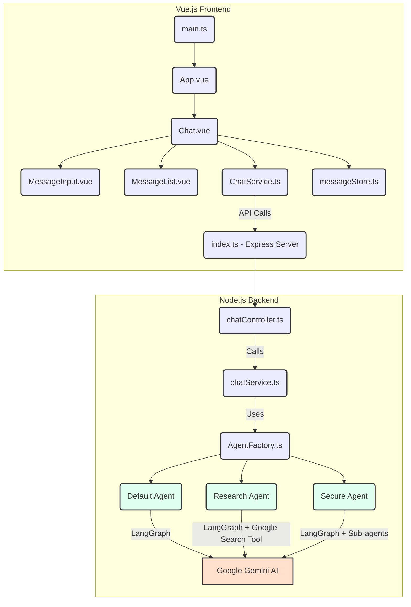

# AI Chat Web Application

A modern AI chat application built with Vue.js frontend and Node.js backend, powered by Google Gemini AI.

## Features

- 🤖 **AI-Powered Chat**: Uses Google Gemini AI for intelligent conversations
- 💬 **Real-time Streaming**: Server-Sent Events (SSE) for live response streaming
- 🎨 **Modern UI**: Clean, responsive Vue.js interface
- 🔧 **Modular Architecture**: Separate backend and frontend packages, with a LangGraph-inspired logic flow
- 📱 **Mobile-Friendly**: Responsive design that works on all devices

## Tech Stack

### Frontend

- **Vue.js 3** with Composition API
- **Vite** for fast development
- **TypeScript** for type safety
- **Pinia** for state management
- **Playwright** for end-to-end testing

### Backend

- **Node.js** with Express
- **Google Gemini AI** (`@google/genai`) for chat responses
- **TypeScript** for type safety
- **LangChain/LangGraph** for agent orchestration
- **tsoa** for OpenAPI specification generation
- **Commander.js** for CLI
- **LangSmith** for observability

## System Architecture

The application follows a client-server architecture with a Vue.js frontend and a Node.js backend. The backend exposes RESTful APIs for the frontend to interact with. At the core, the backend leverages various AI agents, built using LangGraph, to process user requests via the Google Gemini AI models.



### Frontend (`packages/frontend`)

The frontend is a Vue.js 3 application built with Vite.

- `main.ts`: Entry point for the Vue application.
- `App.vue`: The root component, primarily rendering the `Chat` component.
- `Chat.vue`: The main chat interface component, managing state, user input, and message display. It interacts with the `ChatService` to send messages to the backend and fetches available agent types. It uses `messageStore` for global state management of chat messages and loading status.
- `MessageInput.vue`: Component for user message input.
- `MessageList.vue`: Component for displaying chat messages.
- `ChatService.ts`: Handles communication with the backend API (`/api/chat` and `/api/chat/agent-types`).
- `messageStore.ts`: A Pinia store for managing the UI state of messages and loading indicators.

### Backend (`packages/backend`)

The backend is a Node.js Express application with tsoa for API routing and OpenAPI specification generation. It acts as an orchestrator for various AI agents.

- `index.ts`: The main Express server setup, including middleware (CORS, JSON parsing), health check, and route registration. It uses `dotenv` for environment variable loading and initializes the Google GenAI client.
- `tsoa.config.json`: Configuration for `tsoa`, defining entry files, controller globs, and output directories for generated routes and Swagger/OpenAPI specifications.
- `chatController.ts`: Defines the API endpoints for chat interactions (`/chat` for processing messages and `/chat/agent-types` for retrieving agent information). It uses `ChatService` to process messages and `AgentFactory` to get agent types.
- `chatService.ts`: Contains the business logic for processing chat messages. It uses `AgentFactory` to select and delegate message processing to the appropriate AI agent. It also integrates with LangSmith for traceability.
- `agentFactory.ts`: A factory class responsible for creating and managing instances of different AI agents (Default, Research, Secure).
- `src/generated/routes/routes.ts` and `src/generated/swagger/swagger.json`: These files are automatically generated by `tsoa` based on the controllers, defining API routes and the OpenAPI specification.

## Getting Started

Follow these steps to get the application up and running on your local machine.

### Prerequisites

- [Node.js](https://nodejs.org/en/) (v20 or higher)
- [pnpm](https://pnpm.io/)

### Installation

1. **Clone the repository:**

   ```bash
   git clone https://github.com/your-repo/llmops-demo-ts.git
   cd llmops-demo-ts
   ```

2. **Install dependencies:**

   ```bash
   pnpm install
   ```

3. **Set up environment variables:**
   Copy the example environment file and update it with your configuration.

   ```bash
   cp .template.env .env
   ```

   Edit the `.env` file to add your Google API Key, Vertex AI project details, and/or LangSmith API key.

### Running the Application

To run both the frontend and backend concurrently, you can use `pnpm dev` in the root directory. Alternatively, you can run them separately.

1. **Start the Backend:**

   ```bash
   cd packages/backend
   pnpm dev
   ```

   The backend server will start on `http://localhost:3000`.

2. **Start the Frontend:**

   ```bash
   cd packages/frontend
   pnpm dev
   ```

   The frontend development server will start on `http://localhost:4200`.

   Open your browser and navigate to `http://localhost:4200` to access the chat application.

## Running Tests

### Backend Tests

To run unit tests for the backend:

```bash
cd packages/backend
pnpm test
```

### Frontend Tests

To run end-to-end (E2E) tests for the frontend using Playwright:

```bash
cd packages/frontend
pnpm test:e2e
```

## Agents

The application features three distinct AI agents, each designed for specific purposes:

- **Default Agent**: A general-purpose AI assistant capable of maintaining conversation history and optionally executing tools via function calls.
  - [README](/packages/backend/src/agents/default_agent/README.md)

- **Research Agent**: An AI assistant specializing in information gathering and synthesis. It plans search queries, executes web searches (via the Google Search Tool), and synthesizes results to answer user questions comprehensively.
  - [README](/packages/backend/src/agents/research_agent/README.md)

- **Secure Agent**: An AI assistant with enhanced security features to prevent prompt injections and handle sensitive information. It orchestrates input sanitization, request answering, and output sanitization through internal sub-agents.
  - [README](/packages/backend/src/agents/secure_agent/README.md)

## CLI Commands

The backend package includes a CLI tool built with Commander.js, allowing you to interact with the different AI agents directly from your terminal.

To use the CLI, navigate to the `packages/backend` directory and run the following commands:

- **Default Agent:**

  ```bash
  pnpm cli default-agent "Your message here" --model gemini-2.5-flash
  ```

  - Options:
    - `-m, --model [model]`: Specifies the Gemini model to use (default: `gemini-2.5-flash`).
    - `-p, --project [project]`: Specifies the Google Cloud project ID for Vertex AI (optional).
    - `-l, --location [location]`: Specifies the Google Cloud location for Vertex AI (optional).

- **Research Agent:**

  ```bash
  pnpm cli research-agent "Your research query here" --model gemini-2.5-flash
  ```

  - Options:
    - `-m, --model [model]`: Specifies the Gemini model to use (default: `gemini-2.5-flash`).
    - `-p, --project [project]`: Specifies the Google Cloud project ID for Vertex AI (optional).
    - `-l, --location [location]`: Specifies the Google Cloud location for Vertex AI (optional).

- **Secure Agent:**

  ```bash
  pnpm cli secure-agent "Your secure message here" --model gemini-2.5-flash
  ```

  - Options:
    - `-m, --model [model]`: Specifies the Gemini model to use (default: `gemini-2.5-flash`).
    - `-p, --project [project]`: Specifies the Google Cloud project ID for Vertex AI (optional).
    - `-l, --location [location]`: Specifies the Google Cloud location for Vertex AI (optional).

## Environment Variables

This project uses environment variables for configuration, which are loaded from a `.env` file in the project root. A template file, `.template.env`, is provided to help you set up your environment. To get started:

1. Copy `.template.env` to `.env` in the project root:

   ```bash
   cp .template.env .env
   ```

2. Update the `.env` file with your actual values:
   - **Google Gemini API Key**: If using the Gemini Developer API, uncomment `GOOGLE_API_KEY` and set your API key.
   - **Vertex AI**: If using Gemini on Vertex AI, ensure `GOOGLE_GENAI_USE_VERTEXAI` is set to `true`, and provide your `GOOGLE_CLOUD_PROJECT` and `GOOGLE_CLOUD_LOCATION`.
   - **LangSmith Tracing**: To enable LangSmith for observability, set `LANGSMITH_TRACING` to `true` and provide your `LANGSMITH_API_KEY` and `LANGSMITH_PROJECT`.

## Contributing

Please see our [CONTRIBUTION.md](CONTRIBUTION.md) guide for details on how to set up your development environment and contribute to the project.
