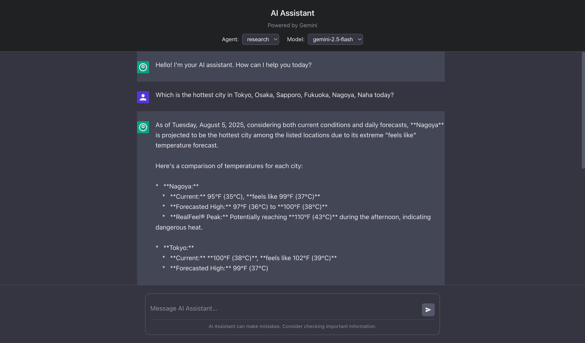

# LLMOps Demo TypeScript

- [日本語](./README.ja.md)

A modular monorepo demonstrating LLMOps practices with Vue.js frontend, Node.js backend, and LangGraph-based AI agents powered by Google Gemini AI.

## Features

- 🤖 **AI-Powered Chat**: Uses Google Gemini AI for intelligent conversations
- 💬 **Real-time Streaming**: Server-Sent Events (SSE) for live response streaming
- 🎨 **Modern UI**: Clean, responsive Vue.js interface
- 🔧 **Modular Architecture**: Separate backend and frontend packages, with a LangGraph-inspired logic flow
- 📱 **Mobile-Friendly**: Responsive design that works on all devices

## 📚 LLM App Development Course

We offer a comprehensive course on building LLM applications and applying LLMOps practices using this repository. It covers environment setup, agent development, security, and evaluation.

👉 **[Start the Course](./docs/projects/README.md)**

## Tech Stack

### Frontend (`packages/frontend`)

- **Vue.js 3** with Composition API
- **Vite** for fast development and building
- **TypeScript** for type safety
- **Pinia** for state management
- **Playwright** for end-to-end testing

### Backend (`packages/backend`)

- **Node.js** with Express
- **TypeScript** for type safety
- **tsoa** for OpenAPI specification generation and routing
- **LangSmith** for observability and tracing

### Agents (`packages/agents`)

- **Google Gemini AI** (`@google/genai`) for chat responses
- **LangChain/LangGraph** for agent orchestration
- **Commander.js** for CLI interface
- **TypeScript** for type safety
- **LangSmith** for observability

### Common (`packages/common`)

- **TypeScript** utilities and shared types
- **Winston** for logging
- Shared interfaces and models across packages

## System Architecture

The application follows a modular monolith architecture with four main packages: frontend, backend, agents, and common. The Vue.js frontend communicates with the Node.js backend via RESTful APIs. The backend orchestrates AI agents from the separate agents package, which leverage Google Gemini AI models through LangGraph workflows.


### Package Details

#### Frontend Architecture

The frontend is a Vue.js 3 application built with Vite, providing a modern chat interface for interacting with AI agents.

- `main.ts`: Entry point for the Vue application, initializes the app and mounts it.
- `App.vue`: The root component that renders the main chat interface.
- `Chat.vue`: The main chat interface component managing user input, message display, and agent selection.
- `MessageInput.vue`: Component for user message input with send functionality.
- `MessageList.vue`: Component for displaying chat messages in a scrollable list.
- `ChatService.ts`: Service class handling HTTP communication with the backend API endpoints.
- `messageStore.ts`: Pinia store managing global state for chat messages, loading states, and agent selection.

#### Backend Architecture

The backend is a Node.js Express application using tsoa for type-safe API routing and OpenAPI specification generation. It serves as the API gateway between the frontend and AI agents.

- `index.ts`: Main Express server setup with middleware configuration, health checks, and route registration.
- `chatController.ts`: tsoa controller defining REST API endpoints for chat interactions and streaming responses.
- `chatService.ts`: Business logic service for processing chat messages and coordinating with AI agents.
- `tsoa.config.json`: Configuration for tsoa code generation and API specification.
- `src/generated/`: Auto-generated routes and OpenAPI specifications from tsoa decorators.

#### Agents Architecture

The agents package contains LangGraph-based AI agents that leverage Google Gemini AI models for various conversational tasks.

- `agentFactory.ts`: Factory class for creating and managing different AI agent instances.
- `baseAgent.ts`: Abstract base class providing common functionality for all agents.
- `default_agent/`: General-purpose AI assistant with basic conversation capabilities.
- `research_agent/`: Research-focused agent with web search and information synthesis capabilities.
- `secure_agent/`: Security-enhanced agent with input/output sanitization and sub-agent orchestration.
- `cli.ts`: Command-line interface for direct agent interaction.
- `utils/`: Shared utilities including GenAI client configuration and agent utilities.

#### Common Architecture

The common package provides shared TypeScript types, utilities, and logging functionality used across all packages.

- `logger.ts`: Winston-based logging configuration used throughout the application.
- `models/`: Shared TypeScript interfaces for Agent, Chat, and other domain models.
- `utils/`: Utility functions for path resolution and common operations.

## Getting Started

Follow these steps to get the application up and running on your local machine.

### Prerequisites

- [Node.js](https://nodejs.org/en/) (v20 or higher)
- [pnpm](https://pnpm.io/)

### Installation

1. **Clone the repository:**

   ```bash
   git clone https://github.com/your-repo/llmops-demo-ts.git
   cd llmops-demo-ts
   ```

2. **Install dependencies:**

   ```bash
   pnpm install
   ```

3. **Set up environment variables:**
   Copy the example environment file and update it with your configuration.

   ```bash
   cp env_template.txt .env
   ```

   Edit the `.env` file to add your Google API Key, Vertex AI project details, and/or LangSmith API key.

### Running the Application

To run both the frontend and backend concurrently, you can use `pnpm dev` in the root directory. Alternatively, you can run them separately.



1. **Start the Backend:**

   ```bash
   cd packages/backend
   pnpm dev
   ```

   The backend server will start on `http://localhost:3000`.

2. **Start the Frontend:**

   ```bash
   cd packages/frontend
   pnpm dev
   ```

   The frontend development server will start on `http://localhost:4200`.

   Open your browser and navigate to `http://localhost:4200` to access the chat application.

## Running Tests

### Backend Tests

To run unit tests for the backend:

```bash
cd packages/backend
pnpm test
```

### Frontend Tests

To run end-to-end (E2E) tests for the frontend using Playwright:

```bash
cd packages/frontend
pnpm test:e2e
```

## Agents

The application features three distinct AI agents, each designed for specific purposes:

- **Default Agent**: A general-purpose AI assistant capable of maintaining conversation history and optionally executing tools via function calls.
  - [README](/packages/agents/src/agents/default_agent/README.md)
  - [日本語](/packages/agents/src/agents/default_agent/README.ja.md)

- **Research Agent**: An AI assistant specializing in information gathering and synthesis. It plans search queries, executes web searches (via the Google Search Tool), and synthesizes results to answer user questions comprehensively.
  - [README](/packages/agents/src/agents/research_agent/README.md)
  - [日本語](/packages/agents/src/agents/research_agent/README.ja.md)

- **Secure Agent**: An AI assistant with enhanced security features to prevent prompt injections and handle sensitive information. It orchestrates input sanitization, request answering, and output sanitization through internal sub-agents.
  - [README](/packages/agents/src/agents/secure_agent/README.md)
  - [日本語](/packages/agents/src/agents/secure_agent/README.ja.md)

## CLI Commands

The agents package includes a CLI tool built with Commander.js for direct interaction with AI agents. The CLI supports running individual agents and managing evaluations.

### Basic Agent Commands

Run AI agents directly from the command line:

- **Default Agent:**

  ```bash
  pnpm --filter @llmops-demo-ts/agents cli default-agent run -t "Your message here" --model gemini-1.5-flash-latest
  ```

- **Research Agent:**

  ```bash
  pnpm --filter @llmops-demo-ts/agents cli research-agent run -t "Your research query here" --model gemini-1.5-flash-latest
  ```

- **Secure Agent:**

  ```bash
  pnpm --filter @llmops-demo-ts/agents cli secure-agent run -t "Your secure message here" --model gemini-1.5-flash-latest
  ```

### Evaluation Commands

Run comprehensive evaluations for the Secure Agent and its sub-agents:

- **Run all Secure Agent evaluations:**

  ```bash
  pnpm --filter @llmops-demo-ts/agents cli secure-agent eval
  ```

- **Input Sanitizer evaluations:**

  ```bash
  # Run LLM-as-a-judge evaluation
  pnpm --filter @llmops-demo-ts/agents cli secure-agent input-sanitizer langsmith eval-llm-as-judge

  # Create evaluation dataset
  pnpm --filter @llmops-demo-ts/agents cli secure-agent input-sanitizer langsmith create-dataset-llm-as-judge
  ```

- **Answer Agent evaluations:**

  ```bash
  # Run LLM-as-a-judge evaluation
  pnpm --filter @llmops-demo-ts/agents cli secure-agent answer-agent langsmith eval-llm-as-judge

  # Run multi-turn evaluation
  pnpm --filter @llmops-demo-ts/agents cli secure-agent answer-agent langsmith eval-multi-turn

  # Create evaluation datasets
  pnpm --filter @llmops-demo-ts/agents cli secure-agent answer-agent langsmith create-dataset-llm-as-judge
  pnpm --filter @llmops-demo-ts/agents cli secure-agent answer-agent langsmith create-dataset-multi-turn
  ```

- **Output Sanitizer evaluations:**

  ```bash
  # Run LLM-as-a-judge evaluation
  pnpm --filter @llmops-demo-ts/agents cli secure-agent output-sanitizer langsmith eval-llm-as-judge

  # Create evaluation dataset
  pnpm --filter @llmops-demo-ts/agents cli secure-agent output-sanitizer langsmith create-dataset-llm-as-judge
  ```

### Common CLI Options

All agent commands support these options:

- `-m, --model [model]`: Specifies the Gemini model to use
- `-p, --project [project]`: Google Cloud project ID for Vertex AI
- `-l, --location [location]`: Google Cloud location for Vertex AI

## Environment Variables

This project uses environment variables for configuration. Copy the template file and configure your settings:

1. Copy the environment template:

   ```bash
   cp env_template.txt .env
   ```

2. Configure the following variables in your `.env` file:
   - **GOOGLE_API_KEY**: Your Google Gemini API key for direct API access
   - **GOOGLE_GENAI_USE_VERTEXAI**: Set to `true` to use Vertex AI instead of direct API
   - **GOOGLE_CLOUD_PROJECT**: Your Google Cloud project ID (required for Vertex AI)
   - **GOOGLE_CLOUD_LOCATION**: Your Google Cloud region (required for Vertex AI, e.g., `us-central1`)

3. Optional variables for advanced features:
   - **LANGSMITH_API_KEY**: API key for LangSmith observability
   - **LANGSMITH_PROJECT**: Project name for LangSmith tracing
   - **LANGSMITH_TRACING**: Set to `true` to enable LangSmith tracing

## Contributing

Please see our [CONTRIBUTION.md](CONTRIBUTION.md) guide for details on how to set up your development environment and contribute to the project.
