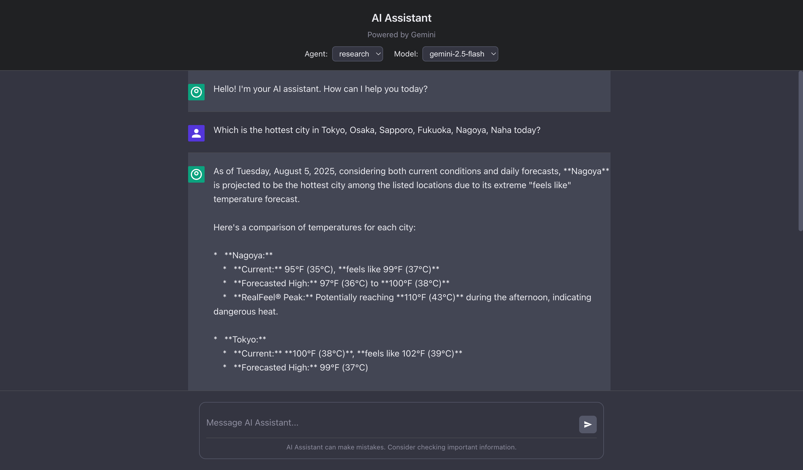

# モジュール 01: 環境セットアップ

**対象読者:** 全てのペルソナ (初級者、中級者、上級者)

このモジュールでは、エージェント固有のコースに進む前に、学習者がアプリケーションスタック全体（フロントエンド + バックエンド + エージェント）を正常に起動できるようにします。

## 前提条件

開始する前に、以下がインストールされていることを確認してください。

- **Node.js**: バージョン 20 以上 ([ダウンロード](https://nodejs.org/))
- **pnpm**: パッケージマネージャー ([インストールガイド](https://pnpm.io/installation))
  - npm を使用してインストールする場合: `npm install -g pnpm`
  - corepack を使用してインストールする場合: `corepack enable pnpm`
- **Trunk IO**: コードリンターとフォーマッター ([インストール](https://trunk.io/))
  - Homebrew を使用してインストールする場合 (macOS): `brew install trunk-io`
- **Google Cloud アカウント** (Vertex AI 用) または **Google Gemini API キー** (直接 API アクセス用)
  - Vertex AI の場合: Vertex AI API が有効化された Google Cloud プロジェクト
  - Gemini API の場合: [Google AI Studio](https://ai.google.dev/gemini-api/docs/api-keys) から取得した API キー
- **LangSmith アカウント** (オプションですが、可観測性と評価のために推奨されます)
  - [LangSmith](https://smith.langchain.com/) でサインアップ
  - 設定ページから API キーを取得

## ステップ 1: リポジトリのクローンと依存関係のインストール

1. **リポジトリをクローン** (まだ行っていない場合):

   ```bash
   git clone <repository-url>
   cd llmops-demo-ts
   ```

2. **pnpm を使用して全ての依存関係をインストール**:

   ```bash
   pnpm install
   ```

   これにより、モノレポ内の全パッケージ（frontend, backend, agents, common）の依存関係がインストールされます。

## ステップ 2: 環境変数の設定

1. **環境変数テンプレートをコピー**:

   ```bash
   cp env_template.txt .env
   ```

2. **エディタで `.env` を開き**、以下の変数を設定します:

   ### オプション A: Gemini API を使用する場合 (初心者向け)

   ```bash
   GOOGLE_API_KEY=your-gemini-api-key-here
   GOOGLE_GENAI_USE_VERTEXAI=false
   ```

   > **注意:** `your-gemini-api-key-here` を [Google AI Studio](https://ai.google.dev/gemini-api/docs/api-keys) から取得した実際の Gemini API キーに置き換えてください。
   >
   > **警告:** 直接 Gemini API のレート制限は比較的小さいため、広範なテストや開発作業には不十分な場合があります。より良いレート制限と本番環境対応のため、Vertex AI（オプション B）の使用をお勧めします。

   ### オプション B: Vertex AI を使用する場合 (本番環境に推奨)

   ```bash
   GOOGLE_GENAI_USE_VERTEXAI=true
   GOOGLE_CLOUD_PROJECT=your-gcp-project-id
   GOOGLE_CLOUD_LOCATION=us-central1
   ```

   > **注意:**
   >
   > - `your-gcp-project-id` をあなたの Google Cloud プロジェクト ID に置き換えてください。
   > - GCP プロジェクトで Vertex AI API が有効になっていることを確認してください。
   > - 認証の設定を行ってください: `gcloud auth application-default login`

   ### オプション: LangSmith の設定 (可観測性のために推奨)

   ```bash
   LANGSMITH_TRACING=true
   LANGSMITH_TRACING_V2=true
   LANGSMITH_ENDPOINT=https://api.smith.langchain.com
   LANGSMITH_PROJECT=llmops-demo-ts
   LANGSMITH_API_KEY=your-langsmith-api-key-here
   ```

   > **注意:** `your-langsmith-api-key-here` をあなたの LangSmith API キーに置き換えてください。これにより、後のモジュールで使用するトレースと評価機能が有効になります。

## ステップ 3: プロジェクトのビルド

全てのパッケージをビルドして、正しくコンパイルできることを確認します:

```bash
pnpm build
```

このコマンドは以下を実行します:

- TypeScript 型の生成
- 全てのパッケージのコンパイル
- バックエンド用の tsoa ルートと OpenAPI 仕様書の生成

## ステップ 4: バックエンドサーバーの起動

1. **ルートディレクトリからバックエンド開発サーバーを起動**:

   ```bash
   pnpm start:backend
   ```

   バックエンドサーバーは `http://localhost:3000` で起動します。

   以下のような出力が表示されるはずです:

   ```text
   Server running on port 3000
   ```

2. **バックエンドが動作しているか確認**:

   新しいターミナルを開き、ヘルスチェックエンドポイントをテストします:

   ```bash
   curl http://localhost:3000/health
   ```

   サーバーが健全であることを示すレスポンスが返ってくるはずです。

## ステップ 5: フロントエンドアプリケーションの起動

1. **新しいターミナルウィンドウを開く** (バックエンドは実行したままにします)

2. **ルートディレクトリからフロントエンド開発サーバーを起動**:

   ```bash
   pnpm start:frontend
   ```

   フロントエンド開発サーバーは `http://localhost:4200` で起動します。

   以下のような出力が表示されるはずです:

   ```text
   VITE v5.x.x  ready in xxx ms
   ➜  Local:   http://localhost:4200/
   ```

## ステップ 6: アプリケーションの確認

1. **ブラウザを開き**、`http://localhost:4200` にアクセスします。

2. **チャットインターフェースが表示される**ことを確認します:
   - 下部にメッセージ入力フィールド
   - エージェントを選択するドロップダウン（Default Agent, Research Agent, Secure Agent）
   - 空のメッセージリスト

3. **アプリケーションをテスト**:
   - ドロップダウンから "Default Agent" を選択
   - シンプルなメッセージを入力: `こんにちは、元気ですか？`
   - Enter キーを押すか、送信ボタンをクリック
   - チャットに AI の応答が表示されるはずです

   

## トラブルシューティング

### バックエンドが起動しない

- **ポート 3000 が既に使用されていないか確認**:

  ```bash
   lsof -i :3000
  ```

  別のプロセスがポート 3000 を使用している場合は、そのプロセスを停止するか、`packages/backend/src/index.ts` でポートを変更してください。

- **環境変数の確認**: `.env` ファイルが存在し、有効な認証情報が含まれているか確認してください。

- **ビルドエラーの確認**: ルートディレクトリから `pnpm build` を実行し、TypeScript のエラーを修正してください。

### フロントエンドが起動しない

- **ポート 4200 が既に使用されていないか確認**:

  ```bash
   lsof -i :4200
  ```

  別のプロセスがポート 4200 を使用している場合、Vite は自動的に次の利用可能なポートを試みます。

- **バックエンドが実行されているか確認**: フロントエンドはバックエンド API にアクセスできる必要があります。

### API 呼び出しが失敗する

- **ブラウザのコンソールを確認**: 開発者ツール (F12) を開き、Console タブでエラーメッセージを確認してください。

- **CORS 設定の確認**: バックエンドが `http://localhost:4200` からのリクエストを許可していることを確認してください。

- **ネットワークタブを確認**: API リクエストが `http://localhost:3000` に対して行われているか確認してください。

### 環境変数の問題

- **`.env` ファイルがルートディレクトリにあることを確認**: `packages/backend` や `packages/frontend` の中ではありません。

- **`.env` 変更後はサーバーを再起動**: 環境変数は起動時に読み込まれます。

- **API キーの形式を確認**: Gemini API キーは通常、特定のプレフィックスで始まります。[Google AI Studio](https://ai.google.dev/gemini-api/docs/api-keys) のドキュメントを確認してください。

## 次のステップ

バックエンドとフロントエンドの両方が正常に起動したら、コースモジュールに進む準備が整いました:

- **初級者**: [モジュール 02: 初級エージェント](./02_beginner_agents.md) へ進む
- **中級者**: [モジュール 03: 中級セキュリティ](./03_intermediate_security.md) へ進む (モジュール 02 完了後)
- **上級者**: [モジュール 04: 上級評価](./04_advanced_evaluation.md) へ進む (モジュール 03 完了後)

## 追加リソース

- [プロジェクト README](../../../README.md) - プロジェクト全体の概要
- [Google Gemini API ドキュメント](https://ai.google.dev/gemini-api/docs)
- [LangSmith ドキュメント](https://docs.smith.langchain.com/)
- [LangGraph ドキュメント](https://langchain-ai.github.io/langgraphjs/)
