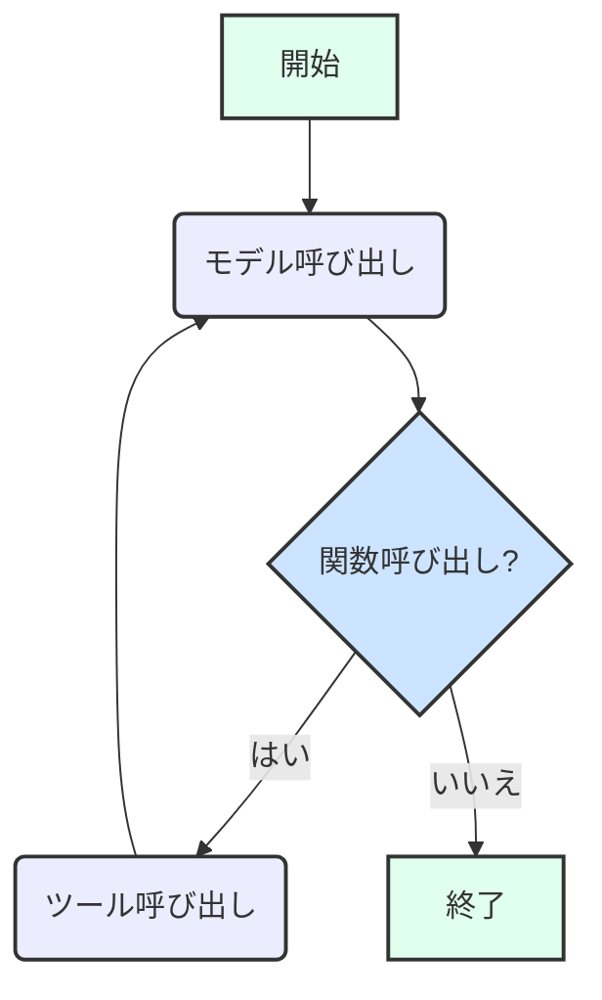

# デフォルトエージェント

[!WARNING]
この document は，[README](./README.md) の日本語訳です。
更新が遅れることがあります。

デフォルトエージェントは、LangGraphを使用して構築された汎用AIアシスタントです。Google Gen AIモデルを活用してユーザーメッセージを処理し、会話履歴を維持し、必要に応じて関数呼び出しを通じてツールを実行します。

## アーキテクチャ

エージェントのコアワークフローは [LangGraph](https://langchain-ai.github.io/langgraphjs/) によって管理され、ユーザー、生成AIモデル、および利用可能なツール間の相互作用を調整します。

### 状態 (State)

エージェントの状態 (`DefaultAgentState`) は以下を追跡します：

- `user_message`: ユーザーからの現在のメッセージ。
- `messages`: `HumanMessage`、`AIMessage`、`FunctionMessage` を含む `BaseMessage` オブジェクトの履歴。これが会話のコンテキストを形成します。
- `function_calls`: モデルによって生成された `FunctionCall` オブジェクトの配列。実行されるべきツールを表します。
- `messageWindowSize`: 会話コンテキストとしてモデルに送信される最近のメッセージ数を設定します。

### ワークフロー

デフォルトエージェントのLangGraphは、2つの主要なノードと条件付きエッジで構成されています：

1. **`call_model` ノード**:
   - `user_message` と会話の `messages` を含む現在の状態を受け取ります。
   - `messageWindowSize` を考慮して、生成AIモデルに送信する会話履歴を準備します。
   - 設定されたGoogle Gen AIモデル（例: `gemini-2.5-flash`）を会話コンテンツで呼び出します。
   - モデルはテキストで応答します（現在、関数呼び出しは無効化されています）。
   - ユーザーからのメッセージ（`HumanMessage`）とモデルからの応答（`AIMessage`）で状態を更新します。

2. **`call_tool` ノード**:
   - 関数呼び出しが無効化されているため、このノードは現在アクティブではありません。
   - 有効化されると、関数呼び出しを実行し、ツールの結果で状態を更新します。

3. **条件付きエッジ (`shouldCallTool`)**:
   - `call_model` ノードの後、この関数は状態に `function_calls` が存在するかどうかを確認します。
   - 現在は関数呼び出しが無効化されているため、グラフは常に `END` に遷移します。
   - 関数呼び出しが再度有効化された場合、`function_calls` が存在すれば、グラフは `call_tool` ノードに遷移します。

現在の実装は、ツール使用を伴わないテキストベースの会話に焦点を当てています。関数呼び出しのインフラストラクチャは整備されていますが、現在の構成では無効になっています。

