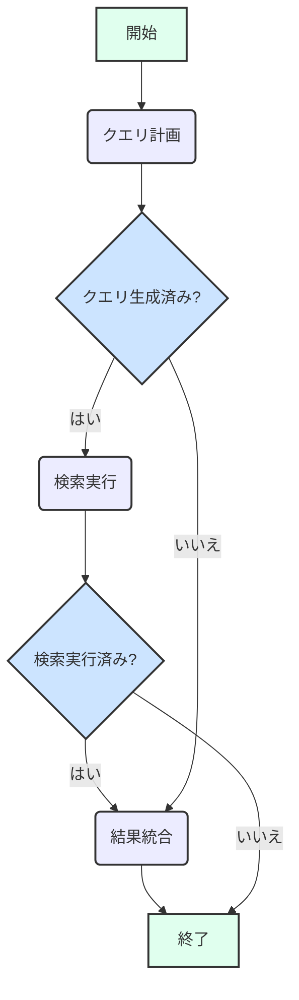

# リサーチエージェント

[!WARNING]
この document は，[README](./README.md) の日本語訳です。
更新が遅れることがあります。

リサーチエージェントは、情報の収集と統合に特化したAIアシスタントです。Google Gen AIモデルとLangGraphフレームワークを活用して、検索クエリの計画、Web検索の実行（Google Search Tool経由）、そして結果の統合を行い、ユーザーの質問に包括的に回答します。

## アーキテクチャ

このエージェントの中核となるワークフローは [LangGraph](https://langchain-ai.github.io/langgraphjs/) によって管理されており、ユーザー、生成AIモデル、および検索ツール間の相互作用をオーケストレーションします。

### ステート (State)

エージェントのステート（`SearchAgentState`）は、以下を追跡します：

- `user_message`: ユーザーからの最初のメッセージまたは質問。
- `response`: エージェントによって提供される最終的な統合された回答。
- `search_queries`: Web検索のためにモデルによって生成されたクエリの文字列配列。
- `search_results`: Web検索からの`query`（クエリ）とそれに対応する`result`（結果）を含むオブジェクトの配列。
- `messages`: 会話のコンテキストを形成する、`HumanMessage`や`AIMessage`を含む`BaseMessage`オブジェクトの履歴。
- `function_calls`: 実行されるツールを表す、モデルによって生成された`FunctionCall`オブジェクトの配列。リサーチエージェントは主に、明示的な`function_calls`呼び出しではなく`config.tools`経由でGoogle Search Toolを使用しますが、このフィールドは一般的なLangGraphステートの一部であり、他の関数呼び出しが導入された場合にそれをキャプチャできます。

### ワークフロー

1. **`plan_queries` ノード**:
   - 現在のステート、特に`user_message`を受け取ります。
   - ユーザーの質問に基づいて関連する検索クエリを生成するようにGoogle Gen AIモデルを呼び出します。
   - モデルのレスポンスを解析して、クエリのJSON配列を抽出します。
   - 生成された`search_queries`でステートを更新します。
   - クエリ計画が失敗した場合にフォールバックメッセージを提供するエラー処理を含みます。

2. **`execute_searches` ノード**:
   - このノードは、`plan_queries`が検索クエリを生成した場合にアクティブになります。
   - 各`search_query`を反復処理し、統合されたGoogle Search Toolを使用してWeb検索を実行するようにGoogle Gen AIモデルに指示します。
   - 同時実行数制限（`runWithConcurrencyLimit`）を設けて検索を並列実行します。
   - `search_results`（クエリとその結果）を収集し、ステートを更新します。
   - 検索実行が失敗した場合にフォールバックメッセージを提供するエラー処理を含みます。

3. **`synthesize_results` ノード**:
   - このノードは、`execute_searches`が検索結果を返した場合、または`plan_queries`が検索実行をスキップして直接統合に進むことを決定した場合（例：クエリが不要だった場合）にアクティブになります。
   - `user_message`と`search_results`を含む現在のステートを受け取ります。
   - 元の質問と収集されたすべての検索結果を提供するプロンプトをGoogle Gen AIモデルに対して構築します。
   - 検索結果から包括的な回答を合成するためにモデルを呼び出します。
   - `response`（最終的な合成された回答）と`AIMessage`でステートを更新します。
   - 合成が失敗した場合や結果が利用できない場合にフォールバックメッセージを提供するエラー処理を含みます。

このフローにより、エージェントはまず何を検索するかを計画し、次に検索を実行し、最後に収集された情報をユーザーのために一貫した回答へと統合します。条件付きエッジ（Conditional edges）は、クエリと結果の有無に基づいて遷移を管理します。

