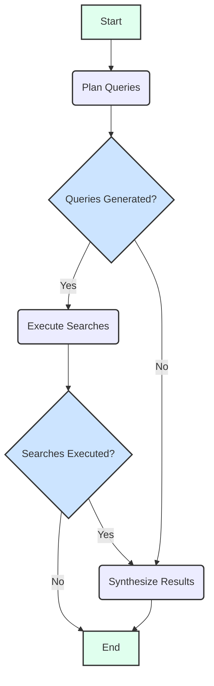

# Research Agent

- [日本語](./README.ja.md)

The Research Agent is an AI assistant specializing in information gathering and synthesis. It leverages the Google Gen AI model and the LangGraph framework to plan search queries, execute web searches (via Google Search Tool), and synthesize the results to answer user questions comprehensively.

## Architecture

The agent's core workflow is managed by a [LangGraph](https://langchain-ai.github.io/langgraphjs/) which orchestrates the interaction between the user, the Generative AI model, and the search tool.

### State

The agent's state (`SearchAgentState`) tracks the following:

- `user_message`: The initial message or question from the user.
- `response`: The final synthesized answer provided by the agent.
- `search_queries`: An array of strings representing the queries generated by the model for web searching.
- `search_results`: An array of objects, each containing a `query` and its corresponding `result` from the web search.
- `messages`: A history of `BaseMessage` objects, including `HumanMessage` and `AIMessage`, forming the conversation context.
- `function_calls`: An array of `FunctionCall` objects generated by the model, representing tools to be executed. Although the Research Agent primarily uses the Google Search Tool via `config.tools` rather than explicit `function_calls` for invocation, this field is part of the generic LangGraph state and can capture other function calls if introduced.

### Workflow

1. **`plan_queries` Node**:
   - Receives the current state, particularly the `user_message`.
   - Invokes the Google Gen AI model with a prompt to generate relevant search queries based on the user's question.
   - Parses the model's response to extract a JSON array of queries.
   - Updates the state with the generated `search_queries`.
   - Includes error handling to provide a fallback message if query planning fails.

2. **`execute_searches` Node**:
   - This node is activated if `plan_queries` generates search queries.
   - Iterates through each `search_query` and invokes the Google Gen AI model, instructing it to perform a web search using its integrated Google Search Tool.
   - Executes searches concurrently with a concurrency limit (`runWithConcurrencyLimit`).
   - Collects the `search_results` (query and its result) and updates the state.
   - Includes error handling to provide a fallback message if search execution fails.

3. **`synthesize_results` Node**:
   - This node is activated if `execute_searches` returns search results, or if `plan_queries` decided to skip search execution and directly proceed to synthesis (e.g., no queries were needed).
   - Receives the current state, including the `user_message` and `search_results`.
   - Constructs a prompt for the Google Gen AI model, providing the original question and all gathered search results.
   - Invokes the model to synthesize a comprehensive answer from the search results.
   - Updates the state with the `response` (the final synthesized answer) and an `AIMessage`.
   - Includes error handling to provide a fallback message if synthesis fails or no results are available.

The flow ensures that the agent first plans what to search, then executes the searches, and finally synthesizes the gathered information into a coherent answer for the user. Conditional edges manage the transitions based on the presence of queries and results.

