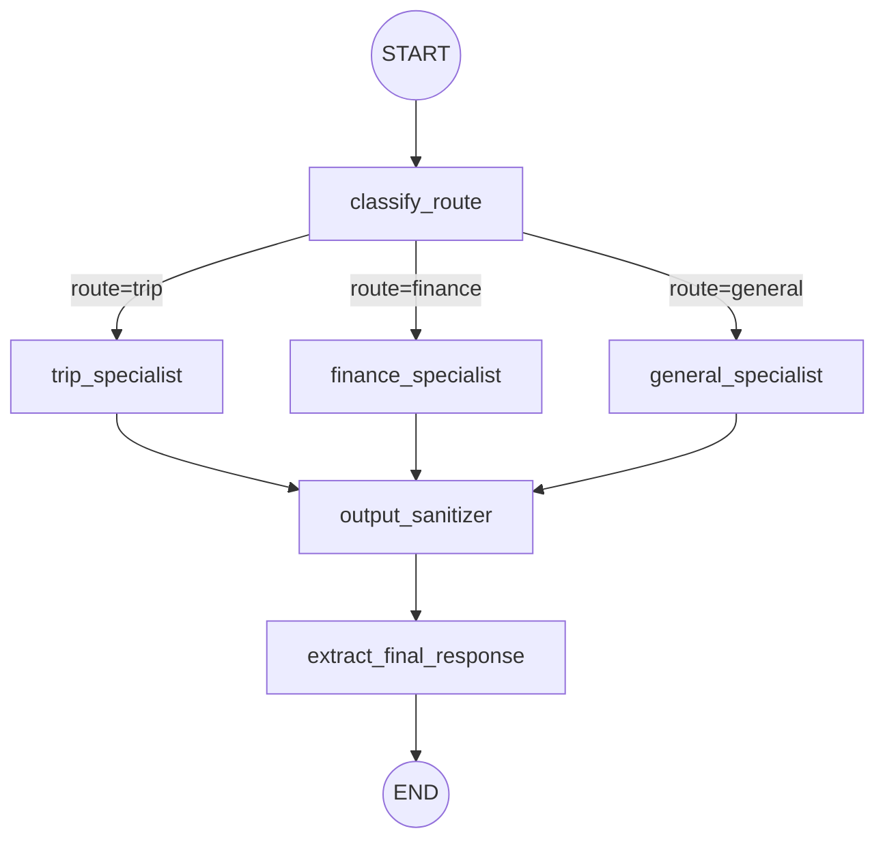

# Routed agent

Routes each user turn to a **trip**, **finance**, or **general** specialist (LangChain `createAgent`), then runs an output check using `ROUTED_AGENT_SANITIZER_MODEL`. Route classification uses `ROUTED_AGENT_ROUTER_MODEL`. Specialist agents and subgraphs live under [`subagents/`](subagents/) (mirroring [`secure_agent/subagents`](../secure_agent/subagents)): [`router/routerNodes.ts`](subagents/router/routerNodes.ts) for `classify_route`, [`trip_agent`](subagents/trip_agent/), [`finance_agent`](subagents/finance_agent/), [`general_agent`](subagents/general_agent/), [`output_sanitizer/`](subagents/output_sanitizer/) for the safety check, and shared [`common/routedSpecialistChatModel.ts`](subagents/common/routedSpecialistChatModel.ts) (uses [`resolveGenAIAuth`](../../utils/genai.ts) from [`utils/genai.ts`](../../utils/genai.ts), same rules as `initializeGenAIClient`). Defaults and optional env overrides are defined in [`routedAgentConstants.ts`](routedAgentConstants.ts).

## Graph Architecture

The graph implements a "classify-then-specialist-then-sanitize" pipeline:

1. **`classify_route`**: Classifies the user message into `trip`, `finance`, or `general` domains using `ROUTED_AGENT_ROUTER_MODEL` (Gemini 3.1 Flash-Lite). It uses structured output (JSON mode) for reliable routing decisions.
2. **Specialist Call**: Routes the message to the corresponding specialist (LangChain `createAgent` with ReAct runtime). Specialists are cached in `SpecialistAgentCache` to avoid graph recompilation.
3. **`output_sanitizer`**: Runs a safety/sanitization check on the generated response using a dedicated subgraph and `ROUTED_AGENT_SANITIZER_MODEL`.
4. **`extract_final_response`**: Finalizes the `ai_response` for the user.



## Vertex AI: location and model IDs

**Router** (`ROUTED_AGENT_ROUTER_MODEL`) and **output sanitizer** (`ROUTED_AGENT_SANITIZER_MODEL`) default to **`gemini-3.1-flash-lite-preview`** ([Gemini 3.1 Flash-Lite](https://docs.cloud.google.com/vertex-ai/generative-ai/docs/models/gemini/3-1-flash-lite)), which is **global** on Vertex. Use **`GOOGLE_CLOUD_LOCATION=global`** with Vertex for those defaults; a regional location (e.g. `us-central1`) can return **404** (`Publisher Model ... was not found`). Override with `ROUTED_AGENT_ROUTER_MODEL` / `ROUTED_AGENT_SANITIZER_MODEL` if you need a model that publishes in your region.

**Specialists** still default to **`gemini-2.5-flash`** via the CLI `-m` / `RoutedAgent` base model unless you pass another ID.

**LangChain specialists (trip / finance / general):** Model construction uses **`resolveGenAIAuth`** from [`utils/genai.ts`](../../utils/genai.ts): Vertex when `GOOGLE_GENAI_USE_VERTEXAI` is set with `GOOGLE_CLOUD_PROJECT` and `GOOGLE_CLOUD_LOCATION`; otherwise **`GOOGLE_API_KEY`** for the Gemini Developer API (`ChatGoogleGenerativeAI` / `ChatVertexAI`).

## Offline evaluation

Evaluations follow the same pattern as the [Secure agent](../secure_agent/README.md): a `targetFunction` plus LLM-as-judge and/or programmatic scores. **Canonical test data** lives in YAML under [`eval/datasets/data/`](eval/datasets/data/) (e.g. `router.yaml`, `trip_specialist.yaml`). **LangSmith** and **Langfuse** each have thin adapters that upload/sync those specs to the provider and run experiments.

- **LangSmith:** dataset helpers in [`eval/langsmith/datasets/langsmith/`](eval/langsmith/datasets/langsmith/), suite runners under each `subagents/<name>/eval/langsmith/llm_judge/` and E2E under [`eval/langsmith/end_to_end/llm_judge/`](eval/langsmith/end_to_end/llm_judge/).
- **Langfuse:** dataset sync in [`eval/langfuse/datasets/`](eval/langfuse/datasets/), shared tracing helpers in [`eval/langfuse/`](eval/langfuse/), suite runners under each `subagents/<name>/eval/langfuse/llm_judge/` and E2E under [`eval/langfuse/end_to_end/llm_judge/`](eval/langfuse/end_to_end/llm_judge/).

### Run all suites (LangSmith)

Runs router, output sanitizer, trip, finance, general specialists, then end-to-end (in that order).

```bash
pnpm --filter @llmops-demo-ts/agents cli routed-agent eval
```

### Run all suites (Langfuse)

Same order as LangSmith.

```bash
pnpm --filter @llmops-demo-ts/agents cli routed-agent eval-langfuse
```

Set **`LANGFUSE_PUBLIC_KEY`**, **`LANGFUSE_SECRET_KEY`**, and optionally **`LANGFUSE_BASE_URL`** (defaults to `https://cloud.langfuse.com`; use your region or self-hosted URL if applicable).

### Specialist Evaluation

Each specialist agent (trip, finance, general) can be evaluated in isolation.

Example for **trip** specialist (LangSmith):

1. Create or refresh the dataset:

   ```bash
   pnpm --filter @llmops-demo-ts/agents cli routed-agent trip langsmith create-dataset-llm-as-judge
   ```

2. Run the evaluation:
   ```bash
   pnpm --filter @llmops-demo-ts/agents cli routed-agent trip langsmith eval-llm-as-judge
   ```

Example for **trip** specialist (Langfuse):

```bash
pnpm --filter @llmops-demo-ts/agents cli routed-agent trip langfuse create-dataset-llm-as-judge
pnpm --filter @llmops-demo-ts/agents cli routed-agent trip langfuse eval-llm-as-judge
```

Replace `trip` with `finance` or `general` for other specialists.

### Router (`classify_route`)

Evaluates domain classification only (trip / finance / general).

#### LangSmith (router)

1. Create or refresh the dataset:

   ```bash
   pnpm --filter @llmops-demo-ts/agents cli routed-agent router langsmith create-dataset-llm-as-judge
   ```

2. Run the evaluation:
   ```bash
   pnpm --filter @llmops-demo-ts/agents cli routed-agent router langsmith eval-llm-as-judge
   ```

#### Langfuse (router)

```bash
pnpm --filter @llmops-demo-ts/agents cli routed-agent router langfuse create-dataset-llm-as-judge
pnpm --filter @llmops-demo-ts/agents cli routed-agent router langfuse eval-llm-as-judge
```

### Output sanitizer

Evaluates the safety check logic in isolation.

#### LangSmith (output sanitizer)

1. Create or refresh the dataset:

   ```bash
   pnpm --filter @llmops-demo-ts/agents cli routed-agent output-sanitizer langsmith create-dataset-llm-as-judge
   ```

2. Run the evaluation:
   ```bash
   pnpm --filter @llmops-demo-ts/agents cli routed-agent output-sanitizer langsmith eval-llm-as-judge
   ```

#### Langfuse (output sanitizer)

```bash
pnpm --filter @llmops-demo-ts/agents cli routed-agent output-sanitizer langfuse create-dataset-llm-as-judge
pnpm --filter @llmops-demo-ts/agents cli routed-agent output-sanitizer langfuse eval-llm-as-judge
```

### End-to-end

Evaluates the full graph (router → specialist → output sanitizer).

#### LangSmith (end-to-end)

1. Create or refresh the dataset:

   ```bash
   pnpm --filter @llmops-demo-ts/agents cli routed-agent end-to-end langsmith create-dataset-llm-as-judge
   ```

2. Run the evaluation:
   ```bash
   pnpm --filter @llmops-demo-ts/agents cli routed-agent end-to-end langsmith eval-llm-as-judge
   ```

#### Langfuse (end-to-end)

```bash
pnpm --filter @llmops-demo-ts/agents cli routed-agent end-to-end langfuse create-dataset-llm-as-judge
pnpm --filter @llmops-demo-ts/agents cli routed-agent end-to-end langfuse eval-llm-as-judge
```

Set `LANGSMITH_API_KEY` and optionally `LANGCHAIN_PROJECT` / `LANGSMITH_ENDPOINT` as for other agent evals.

### Troubleshooting LangSmith dataset commands

- Use **LANGSMITH_API_KEY** or **LANGCHAIN_API_KEY** (either is accepted; eval dataset scripts normalize both and never clear a valid key).
- **403 Forbidden** on dataset APIs: the key needs permission to list and create datasets in that workspace; verify **LANGSMITH_ENDPOINT** matches your deployment (e.g. regional host). For self-hosted LangSmith, check organization RBAC.

### Troubleshooting Langfuse

- Missing keys: ensure **LANGFUSE_PUBLIC_KEY** and **LANGFUSE_SECRET_KEY** are set before `langfuse` subcommands or `eval-langfuse`.
- Dataset create conflicts are treated as reuse; item upserts rely on stable per-item ids derived from the dataset name and optional YAML `id` fields.

### Langfuse score keys (LangSmith parity)

Offline Langfuse experiments use the same LangSmith evaluators via `adaptLangSmithEvaluator`: each returned **`key`** becomes the Langfuse score **`name`**, and **`value`** is always a number in **`[0, 1]`** (non-numeric scores are coerced; values are clamped to the unit interval).

| Score name (`key`)                 | Meaning                                                                    | Typical range | Needs Gemini / Vertex for the score |
| ---------------------------------- | -------------------------------------------------------------------------- | ------------- | ----------------------------------- |
| `correctness_genAI`                | LLM judge: overall correctness vs reference (router or sanitizer prompt)   | 0 or 1        | Yes                                 |
| `route_exact_match`                | Programmatic: `outputs.route` equals reference `expected_route` or `route` | 0 or 1        | No                                  |
| `is_sensitive_accuracy`            | Programmatic: `is_sensitive` matches reference                             | 0 or 1        | No                                  |
| `output_sanitized_reason_accuracy` | Programmatic: sanitizer `reason` matches reference                         | 0 or 1        | No                                  |
| `specialist_quality_genAI`         | LLM judge: specialist answer vs rubric                                     | 0 or 1        | Yes                                 |
| `e2e_quality_genAI`                | LLM judge: end-to-end route + answer vs rubric                             | 0 or 1        | Yes                                 |

If GenAI fails inside a judge, that evaluator usually records **`0`** with comment **`Evaluator error`**; programmatic metrics still run. If an evaluator **throws** before returning a `{ key, score }` object (for example `getGenAI()` failing at evaluator entry), the adapter still records **`0`** using the evaluator function’s JavaScript **`name`** when available so Langfuse never shows a blank score column.

Full per-suite checklist (including Secure agent suites) lives in [`eval/langfuse/LANGFUSE_OFFLINE_EVAL_SCORES.md`](eval/langfuse/LANGFUSE_OFFLINE_EVAL_SCORES.md).

## Run the agent (CLI)

```bash
pnpm --filter @llmops-demo-ts/agents cli routed-agent run -t "Plan a day in Kyoto"
```
