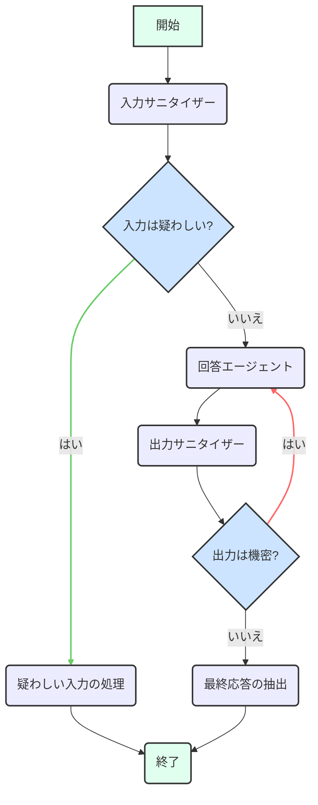

# Secure Agent

[!WARNING]
この document は，[README](./README.md) の日本語訳です。
更新が遅れることがあります。

Secure Agentは、プロンプトインジェクションの防止や機密情報の取り扱いに特化した、強化されたセキュリティ機能を備えたAIアシスタントです。Google Gen AIモデルとLangGraphフレームワークを活用して、入力のサニタイズ、リクエストへの回答、出力のサニタイズをオーケストレーションします。

## アーキテクチャ

エージェントのコアワークフローは、[LangGraph](https://langchain-ai.github.io/langgraphjs/)によって管理されており、ユーザー、生成AIモデル、および内部サブエージェント間の相互作用を調整します。

### 状態 (State)

- `user_message`: ユーザーからの最初のメッセージまたは質問。
- `messages`: 会話のコンテキストを形成する、`HumanMessage`や`AIMessage`を含む`BaseMessage`オブジェクトの履歴。
- `sanitized_message`: 入力サニタイザーによって処理された後のユーザーメッセージ。
- `is_suspicious`: ユーザーの入力が疑わしいと分類されたかどうかを示すブール値フラグ。
- `suspicious_reason`: 入力を疑わしいと分類した理由を提供する文字列。
- `confidence`: 入力サニタイズ分類の信頼度スコア (0-1) を表す数値。
- `ai_response`: エージェントによって提供される最終的な合成回答。
- `is_sensitive`: エージェントの出力に機密情報が含まれているかどうかを示すブール値フラグ。
- `feedback_message`: 出力が機密であると判断された場合に、改善のために`answer_agent`サブエージェントにフィードバックを提供するために使用されるメッセージ。
- `messageWindowSize`: 言語モデルの会話コンテキストに含める過去のメッセージ数。
- `next_step`: エージェントのワークフロー内で遷移する次のステップまたはノードを示す文字列（条件付きルーティングのために内部で使用されます）。

### ワークフロー

1. **`input_sanitizer` ノード**:
   - 現在の状態（特に`user_message`と`messages`）を受け取ります。
   - Input Sanitizerサブエージェントを呼び出して、ユーザーの入力を分類します。
   - `sanitized_message`（疑わしい場合は空）と`is_suspicious`で状態を更新します。
   - **条件付き遷移**: `is_suspicious`がtrueの場合、グラフは`handle_suspicious_input`に遷移して安全な応答を提供します。それ以外の場合は、`answer_agent`に進みます。

2. **`answer_agent` ノード**:
   - `sanitized_message`（サニタイズされていない場合は元の`user_message`）と`messages`を含む現在の状態を受け取ります。
   - `feedback_message`が存在する場合（以前の`output_sanitizer`ループから）、このフィードバックを`user_message`に追加して、モデルの改善を促します。
   - Answer Agentサブエージェントを呼び出して、（サニタイズされた）ユーザーのリクエストに基づいて応答を生成します。
   - `ai_response`と更新された`messages`履歴で状態を更新します。また、`feedback_message`をクリアします。
   - **直接遷移**: `output_sanitizer`に進みます。

3. **`output_sanitizer` ノード**:
   - `ai_response`と`messages`を含む現在の状態を受け取ります。
   - Output Sanitizerサブエージェントを呼び出して、生成された`ai_response`に機密情報が含まれているかどうかを確認します。
   - `is_sensitive`と`feedback_message`（出力が機密の場合）で状態を更新します。
   - **条件付き遷移**: `is_sensitive`がtrueの場合、グラフは改善のために`answer_agent`にループバックします（`feedback_message`を使用）。それ以外の場合は、`extract_final_response`に遷移します。

4. **`handle_suspicious_input` ノード**:
   - 入力が疑わしいと判断された場合、このノードはリクエストを処理できないことを説明する、標準化された安全な応答をユーザーに提供します。
   - **直接遷移**: `END`に進みます。

5. **`extract_final_response` ノード**:
   - 状態から最終的な`ai_response`を抽出します。
   - **直接遷移**: `END`に進みます。

このワークフローにより、すべての入力が処理前に潜在的な脅威がないかチェックされ、すべての出力がユーザーに配信される前に機密コンテンツがないか確認されます。機密情報が検出された場合は、改善ループにつながる可能性があります。



## LangSmithによるエージェント評価

Secure Agentとそのサブエージェントは、[LangSmith](https://www.langchain.com/langsmith)を使用して評価され、その有効性とセキュリティプロトコルの順守が保証されます。評価プロセスには以下が含まれます。

### 1. 入力サニタイザーの評価

- **目的**: Input Sanitizerサブエージェントがユーザー入力を疑わしいか安全か正確に分類し、適切にサニタイズする能力を評価します。
- **方法**: LangSmithを使用したLLM-as-a-judge（裁判官としてのLLM）アプローチを利用します。
  - **評価者 (Evaluators)**:
    - `correctnessEvaluatorGenAI`: 参照出力に基づいてサニタイズの全体的な正確性を判断します。
    - `isSuspiciousAccuracy`: `is_suspicious`フラグの精度を測定します。
    - `sanitizedMessageAccuracy`: `sanitized_message`が期待される出力と一致するかどうかを確認します。

評価を実行するには、まずデータセットを作成します。

```bash
pnpm --filter @llmops-demo-ts/backend cli secure-agent input-sanitizer langsmith create-dataset-llm-as-judge
```

次に、評価を実行します。

```bash
pnpm --filter @llmops-demo-ts/backend cli secure-agent input-sanitizer langsmith eval-llm-as-judge
```

### 2. 回答エージェントの評価

#### LLM-as-a-Judge 評価

- **目的**: （サニタイズされた）ユーザーのリクエストに基づいて、Answer Agentサブエージェントが正確で役立つ応答を提供する能力を評価します。
- **方法**: LangSmithを使用したLLM-as-a-judgeアプローチを採用します。
  - **評価者 (Evaluator)**:
    - `correctnessEvaluatorGenAI`: 参照出力に対する生成された`ai_response`の正確性と有用性を評価します。

評価を実行するには、まずデータセットを作成します。

```bash
pnpm --filter @llmops-demo-ts/backend cli secure-agent answer-agent langsmith create-dataset-llm-as-judge
```

次に、評価を実行します。

```bash
pnpm --filter @llmops-demo-ts/backend cli secure-agent answer-agent langsmith eval-llm-as-judge
```

#### マルチターン評価

- **目的**: マルチターン会話におけるAnswer Agentサブエージェントのパフォーマンスを評価し、特に複数のターンにわたるユーザー満足度と全体的な有用性に焦点を当てます。
- **方法**: LangSmithの`openevals`ライブラリを使用してマルチターンシミュレーションを実施します。
  - **評価者 (Evaluator)**:
    - `trajectoryEvaluator`: 会話の軌跡全体をユーザー満足度とエージェントの有用性について評価するカスタムLLM-as-a-judgeです。

評価を実行するには、まずデータセットを作成します。

```bash
pnpm --filter @llmops-demo-ts/backend cli secure-agent answer-agent langsmith create-dataset-multi-turn
```

次に、評価を実行します。

```bash
pnpm --filter @llmops-demo-ts/backend cli secure-agent answer-agent langsmith eval-multi-turn
```

### 3. 出力サニタイザーの評価

- **目的**: AI生成応答内の機密情報を識別およびフラグ付けするOutput Sanitizerサブエージェントの有効性を評価します。
- **方法**: LangSmithを使用したLLM-as-a-judgeアプローチを使用します。
  - **評価者 (Evaluators)**:
    - `correctnessEvaluatorGenAI`: 参照出力に基づいて機密出力分類の全体的な正確性を判断します。
    - `isSensitiveAccuracy`: `is_sensitive`フラグの精度を測定します。
    - `outputSanitizedMessageAccuracy`: `feedback_message`（機密性の理由）が期待される出力と一致するかどうかを確認します。

評価を実行するには、まずデータセットを作成します。

```bash
pnpm --filter @llmops-demo-ts/backend cli secure-agent output-sanitizer langsmith create-dataset-llm-as-judge
```

次に、評価を実行します。

```bash
pnpm --filter @llmops-demo-ts/backend cli secure-agent output-sanitizer langsmith eval-llm-as-judge
```

すべての評価は、次のコマンドを使用して同時に実行できます。

```bash
pnpm --filter @llmops-demo-ts/backend cli secure-agent eval
```
