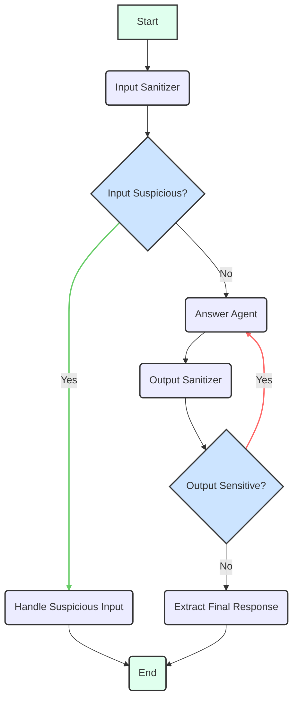

# Secure Agent

- [日本語](./README.ja.md)

The Secure Agent is an AI assistant with enhanced security features, specializing in preventing prompt injections and handling sensitive information. It leverages the Google Gen AI model and the LangGraph framework to orchestrate input sanitization, request answering, and output sanitization.

## Architecture

The agent's core workflow is managed by a [LangGraph](https://langchain-ai.github.io/langgraphjs/) which orchestrates the interaction between the user, the Generative AI model, and its internal sub-agents.

### State

- `user_message`: The initial message or question from the user.
- `messages`: A history of `BaseMessage` objects, including `HumanMessage` and `AIMessage`, forming the conversation context.
- `sanitized_message`: The user message after it has been processed by the input sanitizer.
- `is_suspicious`: A boolean flag indicating whether the user's input was classified as suspicious.
- `suspicious_reason`: A string providing the reason for classifying the input as suspicious.
- `confidence`: A number representing the confidence score (0-1) of the input sanitization classification.
- `ai_response`: The final synthesized answer provided by the agent.
- `is_sensitive`: A boolean flag indicating whether the agent's output contains sensitive information.
- `feedback_message`: A message used to provide feedback to the `answer_agent` sub-agent for refinement if the output is deemed sensitive.
- `messageWindowSize`: The number of past messages to include in the conversation context for the language model.
- `next_step`: A string indicating the next step or node to transition to within the agent's workflow (used internally for conditional routing).

### Workflow

1. **`input_sanitizer` Node**:
   - Receives the current state, particularly `user_message` and `messages`.
   - Invokes the Input Sanitizer sub-agent to classify the user's input.
   - Updates the state with `sanitized_message` (empty if suspicious) and `is_suspicious`.
   - **Conditional Transition**: If `is_suspicious` is true, the graph transitions to `handle_suspicious_input` to provide a safe response. Otherwise, it proceeds to `answer_agent`.

2. **`answer_agent` Node**:
   - Receives the current state, including `sanitized_message` (or original `user_message` if not sanitized) and `messages`.
   - If a `feedback_message` is present (from a previous `output_sanitizer` loop), it appends this feedback to the `user_message` to guide the model's refinement.
   - Invokes the Answer Agent sub-agent to generate a response based on the (sanitized) user's request.
   - Updates the state with `ai_response` and the updated `messages` history. It also clears any `feedback_message`.
   - **Direct Transition**: Proceeds to `output_sanitizer`.

3. **`output_sanitizer` Node**:
   - Receives the current state, including `ai_response` and `messages`.
   - Invokes the Output Sanitizer sub-agent to check if the generated `ai_response` contains sensitive information.
   - Updates the state with `is_sensitive` and `feedback_message` (if the output is sensitive).
   - **Conditional Transition**: If `is_sensitive` is true, the graph loops back to `answer_agent` for refinement (using the `feedback_message`). Otherwise, it transitions to `extract_final_response`.

4. **`handle_suspicious_input` Node**:
   - If the input is deemed suspicious, this node provides a standardized, safe response to the user, explaining that the request cannot be processed.
   - **Direct Transition**: Proceeds to `END`.

5. **`extract_final_response` Node**:
   - Extracts the final `ai_response` from the state.
   - **Direct Transition**: Proceeds to `END`.

This workflow ensures that all inputs are checked for potential threats before processing, and all outputs are reviewed for sensitive content before being delivered to the user, potentially leading to refinement loops if sensitive information is detected.



## Agent Evaluation with LangSmith

The Secure Agent and its sub-agents are evaluated using [LangSmith](https://www.langchain.com/langsmith) to ensure their effectiveness and adherence to security protocols. The evaluation process involves:

### 1. Input Sanitizer Evaluation

- **Purpose**: To assess the Input Sanitizer sub-agent's ability to accurately classify user inputs as suspicious or safe, and to sanitize them appropriately.
- **Method**: Utilizes an LLM-as-a-judge approach with LangSmith.
  - **Evaluators**:
    - `correctnessEvaluatorGenAI`: Judges the overall correctness of the sanitization based on reference outputs.
    - `isSuspiciousAccuracy`: Measures the accuracy of the `is_suspicious` flag.
    - `sanitizedMessageAccuracy`: Checks if the `sanitized_message` matches the expected output.

To run the evaluation, first create the dataset:

```bash
pnpm --filter @llmops-demo-ts/backend cli secure-agent input-sanitizer langsmith create-dataset-llm-as-judge
```

Then, run the evaluation:

```bash
pnpm --filter @llmops-demo-ts/backend cli secure-agent input-sanitizer langsmith eval-llm-as-judge
```

### 2. Answer Agent Evaluation

#### LLM-as-a-Judge Evaluation

- **Purpose**: To evaluate the Answer Agent sub-agent's ability to provide correct and helpful responses based on the (sanitized) user's request.
- **Method**: Employs an LLM-as-a-judge approach with LangSmith.
  - **Evaluator**:
    - `correctnessEvaluatorGenAI`: Assesses the correctness and helpfulness of the generated `ai_response` against reference outputs.

To run the evaluation, first create the dataset:

```bash
pnpm --filter @llmops-demo-ts/backend cli secure-agent answer-agent langsmith create-dataset-llm-as-judge
```

Then, run the evaluation:

```bash
pnpm --filter @llmops-demo-ts/backend cli secure-agent answer-agent langsmith eval-llm-as-judge
```

#### Multi-turn Evaluation

- **Purpose**: To assess the Answer Agent sub-agent's performance in multi-turn conversations, specifically focusing on user satisfaction and overall helpfulness across multiple turns.
- **Method**: Conducts a multi-turn simulation using LangSmith's `openevals` library.
  - **Evaluator**:
    - `trajectoryEvaluator`: A custom LLM-as-a-judge that evaluates the entire conversation trajectory for user satisfaction and agent helpfulness.

To run the evaluation, first create the dataset:

```bash
pnpm --filter @llmops-demo-ts/backend cli secure-agent answer-agent langsmith create-dataset-multi-turn
```

Then, run the evaluation:

```bash
pnpm --filter @llmops-demo-ts/backend cli secure-agent answer-agent langsmith eval-multi-turn
```

### 3. Output Sanitizer Evaluation

- **Purpose**: To assess the Output Sanitizer sub-agent's effectiveness in identifying and flagging sensitive information within the AI-generated responses.
- **Method**: Uses an LLM-as-a-judge approach with LangSmith.
  - **Evaluators**:
    - `correctnessEvaluatorGenAI`: Judges the overall correctness of the sensitive output classification based on reference outputs.
    - `isSensitiveAccuracy`: Measures the accuracy of the `is_sensitive` flag.
    - `outputSanitizedMessageAccuracy`: Checks if the `feedback_message` (reason for sensitivity) matches the expected output.

To run the evaluation, first create the dataset:

```bash
pnpm --filter @llmops-demo-ts/backend cli secure-agent output-sanitizer langsmith create-dataset-llm-as-judge
```

Then, run the evaluation:

```bash
pnpm --filter @llmops-demo-ts/backend cli secure-agent output-sanitizer langsmith eval-llm-as-judge
```

All evaluations can be run simultaneously using the following command:

```bash
pnpm --filter @llmops-demo-ts/backend cli secure-agent eval
```
