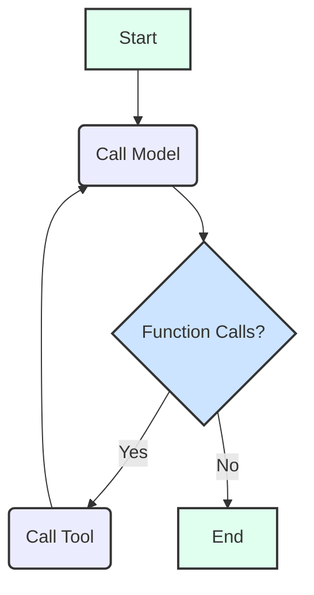

# Default Agent

The Default Agent is a general-purpose AI assistant built using LangGraph. It leverages the Google Gen AI model to process user messages, maintain conversation history, and optionally execute tools via function calls.

## Architecture

The agent's core workflow is managed by a [LangGraph](https://langchain-ai.github.io/langgraphjs/) which orchestrates the interaction between the user, the Generative AI model, and any available tools.

### State

The agent's state (`DefaultAgentState`) tracks the following:

- `user_message`: The current message from the user.
- `messages`: A history of `BaseMessage` objects, including `HumanMessage`, `AIMessage`, and `FunctionMessage`, which forms the conversation context.
- `function_calls`: An array of `FunctionCall` objects generated by the model, representing tools to be executed.
- `messageWindowSize`: Configures how many recent messages are included in the conversation context sent to the model.

### Workflow

The LangGraph for the Default Agent consists of two main nodes and a conditional edge:

1. **`call_model` Node**:
   - Receives the current state, including the `user_message` and conversation `messages`.
   - Prepares the conversation history to be sent to the Generative AI model, considering the `messageWindowSize`.
   - Invokes the configured Google Gen AI model (e.g., `gemini-2.5-flash`) with the conversation content and `getCurrentTimeToolDeclaration` for function calling.
   - The model can decide to respond with text or suggest `function_calls`.
   - Updates the state with the `HumanMessage` and the `AIMessage` from the model's response.

2. **`call_tool` Node**:
   - This node is activated only if the `call_model` node generates `function_calls`.
   - Executes the `function_calls` (e.g., `getCurrentTime` function).
   - Updates the state with the `FunctionMessage` results from the tool execution.
   - Clears the `function_calls` array in the state to prevent re-execution or infinite loops.

3. **Conditional Edge (`shouldCallTool`)**:
   - After the `call_model` node, this function checks if `function_calls` are present in the state.
   - If `function_calls` exist, the graph transitions to the `call_tool` node.
   - If no `function_calls` are present, the graph transitions to `END`, signifying the completion of the current turn.

The flow is designed to allow the model to dynamically decide whether a tool needs to be called to fulfill the user's request. After a tool is called, the result is fed back to the model for further processing or to synthesize a final response.

