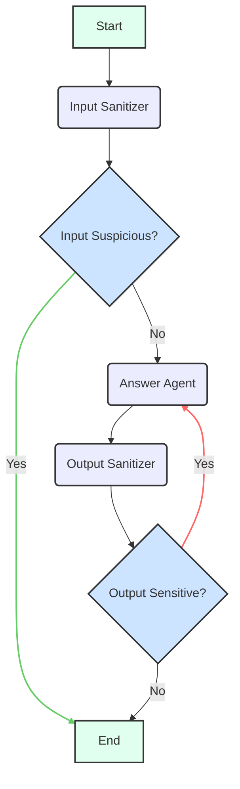

# Secure Agent

The Secure Agent is an AI assistant with enhanced security features, specializing in preventing prompt injections and handling sensitive information. It leverages the Google Gen AI model and the LangGraph framework to orchestrate input sanitization, request answering, and output sanitization.

## Architecture

The agent's core workflow is managed by a [LangGraph](https://langchain-ai.github.io/langgraphjs/) which orchestrates the interaction between the user, the Generative AI model, and its internal sub-agents.

### State

- `user_message`: The initial message or question from the user.
- `messages`: A history of `BaseMessage` objects, including `HumanMessage` and `AIMessage`, forming the conversation context.
- `sanitized_message`: The user message after it has been processed by the input sanitizer.
- `is_suspicious`: A boolean flag indicating whether the user's input was classified as suspicious.
- `suspicious_reason`: A string providing the reason for classifying the input as suspicious.
- `confidence`: A number representing the confidence score (0-1) of the input sanitization classification.
- `ai_response`: The final synthesized answer provided by the agent.
- `is_sensitive`: A boolean flag indicating whether the agent's output contains sensitive information.
- `feedback_message`: A message used to provide feedback to the `answer_agent` sub-agent for refinement if the output is deemed sensitive.
- `messageWindowSize`: The number of past messages to include in the conversation context for the language model.
- `next_step`: A string indicating the next step or node to transition to within the agent's workflow (used internally for conditional routing).

### Workflow

1. **`input_sanitizer` Node**:
   - Receives the current state, particularly `user_message` and `messages`.
   - Invokes the Input Sanitizer sub-agent to classify the user's input.
   - Updates the state with `sanitized_message` (empty if suspicious) and `is_suspicious`.
   - **Conditional Transition**: If `is_suspicious` is true, the graph ends, and an error message is returned. Otherwise, the flow proceeds to `answer_agent`.

2. **`answer_agent` Node**:
   - Receives the current state, including `sanitized_message` (or original `user_message` if not sanitized) and `messages`.
   - If a `feedback_message` is present (from a previous `output_sanitizer` loop), it appends this feedback to the `user_message` to guide the model's refinement.
   - Invokes the Answer Agent sub-agent to generate a response based on the (sanitized) user's request.
   - Updates the state with `ai_response` and the updated `messages` history. It also clears any `feedback_message`.
   - **Direct Transition**: Proceeds to `output_sanitizer`.

3. **`output_sanitizer` Node**:
   - Receives the current state, including `ai_response` and `messages`.
   - Invokes the Output Sanitizer sub-agent to check if the generated `ai_response` contains sensitive information.
   - Updates the state with `is_sensitive` and `feedback_message` (if the output is sensitive).
   - **Conditional Transition**: If `is_sensitive` is true, the graph loops back to `answer_agent` for refinement (using the `feedback_message`). Otherwise, the graph ends, and the `ai_response` is returned.

This workflow ensures that all inputs are checked for potential threats before processing, and all outputs are reviewed for sensitive content before being delivered to the user, potentially leading to refinement loops if sensitive information is detected.

## Evaluation with LangSmith

The Secure Agent and its sub-agents are evaluated using [LangSmith](https://www.langchain.com/langsmith) to ensure their robustness and effectiveness. The evaluations are conducted using the CLI commands defined in `packages/backend/src/agents/secure_agent/cli.ts`.

### Input Sanitizer Evaluation

The `input_sanitizer` sub-agent is evaluated using an **LLM-as-a-judge** approach to assess its ability to correctly classify user inputs as `SAFE` or `SUSPICIOUS` and provide appropriate sanitized messages.

```bash
pnpm --filter @llmops-ts/backend secure-agent input-sanitizer langsmith llm-as-judge
```

### Answer Agent Evaluation

The `answer_agent` sub-agent undergoes two types of evaluations:

1. **LLM-as-a-judge**: This evaluation assesses the correctness and helpfulness of the agent's generated responses based on a reference output.

   ```bash
   pnpm --filter @llmops-ts/backend secure-agent answer-agent langsmith llm-as-judge
   ```

2. **Multi-turn Evaluation**: This evaluates the agent's performance in a conversational setting, simulating a user's multi-turn interaction to assess overall satisfaction and helpfulness over several exchanges.

   ```bash
   pnpm --filter @llmops-ts/backend secure-agent answer-agent langsmith multi-turn
   ```

### Output Sanitizer Evaluation

The `output_sanitizer` sub-agent is evaluated using an **LLM-as-a-judge** approach to verify its capability to identify and flag sensitive information in the agent's output, and to provide a reason for the classification.

```bash
pnpm --filter @llmops-ts/backend secure-agent output-sanitizer langsmith llm-as-judge
```


